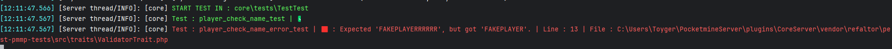

# Pest PMMP Tests


> **Simple & elegant** unit testing for PocketMine-MP inspired by [Pest](https://pestphp.com) and powered [Await Generator](https://github.com/SOFe/await-generator).

## 📦 Installation

```bash
composer require refaltor/pest-pmmp-tests
```
## 📦 Simple Usage
> In your PocketMine plugin, you can easily integrate this unit testing library and run it either through a command or directly in onEnable — it’s totally up to you.
```PHP
 public function onEnable(): void
 {
     # tester load
     PocketMineTester::initPlugin($this);
     PocketMineTester::launchTest(__DIR__ . '/tests', "core\\tests\\");
 }
```
#### Project Structure Example :
```
my-plugin/
├── src/
│   └── core/
│       └── Main.php
├── tests/
│   └── MyFirstTest.php
├── plugin.yml
├── composer.json
└── README.md
```

## 📦 Test Example
> Note: For your tests to run, your .php file must end with ...Test.php, and all the functions within that file must end with ...test().
```PHP
<?php

namespace core\tests;

use core\Main;
use Generator;
use Refaltor\PestPmmpTests\tests\PmmpTest;
use SOFe\AwaitGenerator\Await;

class TestTest extends PmmpTest
{
    public function player_check_name_test(): Generator
    {
        $player = $this->getFakePlayer();
        
        $this->assertString("FAKEPLAYER", $player->getName());

        return yield Await::ALL;
    }

    public function player_check_name_error_test(): Generator
    {
        $player = $this->getFakePlayer();

        $this->assertString("FAKEPLAYERRRRRR", $player->getName());

        return yield Await::ALL;
    }

    public function onBeforeAllTest(): void
    {
        Main::getInstance()->getLogger()->info("Units test is starting...");
    }

    public function onAfterAllTest(): void
    {
        Main::getInstance()->getLogger()->info("Units test is finish.");
    }
}
```
#### Result :
